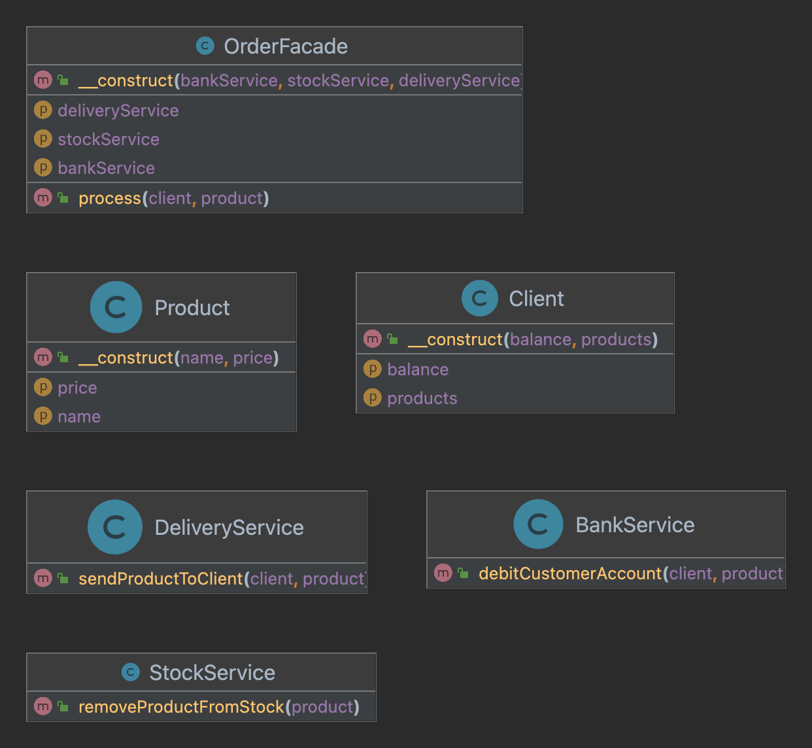

# Le pattern Facade

---

[Formation laravel de base](../../README.md) > [Rappel et remise a niveau](../README.md) > [Apercu des design patterns](README.md) > Le pattern Facade

---

Façade est un patron de conception structurel qui procure une interface offrant un accès simplifié à une librairie, 
un framework ou à n’importe quel ensemble complexe de classes.

## Cas d'utilisation

Nous souhaitons gérer le processus de gestion de commande.

A l'arrivé d'une nouvelle commande nous devons effectuer 
les traitements suivant : 
 - Retirer le produit des stocks
 - Enregistrer le paiement
 - Livrer le produit

La facade permettra de cacher la complexité de ce processus 

## Mise en pratique

