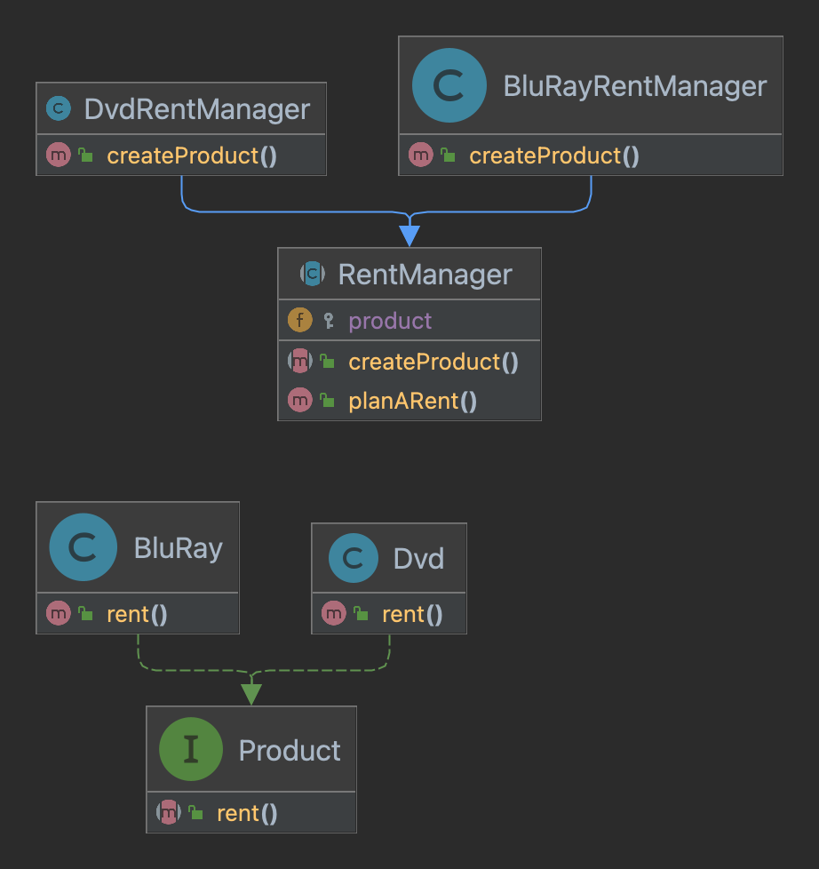

# Le pattern Factory

---

[Formation laravel de base](../../README.md) > [Rappel et remise a niveau](../README.md) > [Apercu des design patterns](README.md) > Le pattern Factory

---

La Factory est un patron de conception de création qui définit une
interface pour créer des objets dans une classe mère,
mais délègue le choix des types d’objets à créer aux sous-classes.

## Cas d'utilisation

Nous développons une application de location de DVD.
Avec le développement du Blu-Ray il est tant d'en proposer a ses clients.

La factory va nous permettre de mutualiser le code metier present dans
la class DVD dans la classe BluRay.

La factory sera alors responsable de la création des objets DVD et BluRay.

## Mise en pratique

