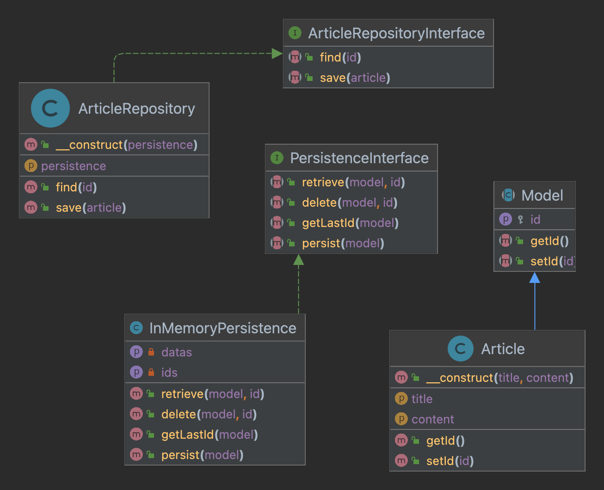

# Le pattern Repository

---

[Formation laravel de base](../../README.md) > [Rappel et remise a niveau](../README.md) > [Apercu des design patterns](README.md) > Le pattern Repository

---

Un repository permet de separer la partie metier de l'enregistrement des donnnées.
Le repository offre les avantages suivant :
 - Centraliser la logique d'accés aux données
 - Tester la logique métier séparément de l'enregistrement des données
 - Reduire la duplication de code

## Mise en pratique

