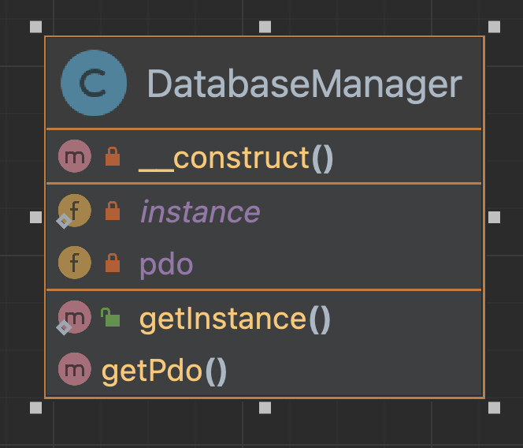

# Le pattern Singleton

---

[Formation laravel de base](../../README.md) > [Rappel et remise a niveau](../README.md) > [Apercu des design patterns](README.md) > Le pattern Singleton

---

Le singleton est un pattern de création qui nous permet de 
s'assurer qu'une classe à une instance unique en founissant un
point d'acces global a cette derniere.

## Cas pratique

Afin d'acceder à notre base de données nous souhaitons une instance unique de PDO.

