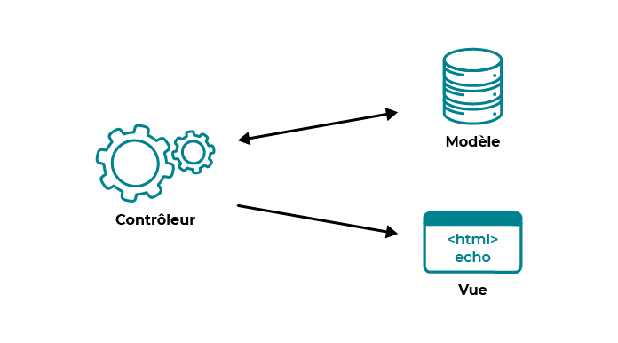

# L'architecture MVC

---

[Formation laravel de base](../../README.md) > [Rappel et remise a niveau](../README.md) > L'architecture MVC

---

L'architecture MVC ou Modèle - Vue - Controlleur est un design pattern très célèbre.

Le but de cette architecture est de mieux organiser son code en séparant 
la logique en trois partie.

## Le modèle

Cette partie gère la logique métier. On y retrouve donc l'accès à la 
base de donnée mais aussi le code qui prend des decisions autour de ces
données.

Son but est de fournir une interface d'action la plus simple possible au controlleur.

## La vue

Cette partie s'occupe de l'affichage. Elle ne doit pas faire de calcul
et se contente de récupérer les variables pour savoir ce qu'elle doit afficher.

On y trouve principalement de l'HTML et quelques boucle en PHP.

Il existe quelques moteur de template tel que Blade ou Twig pour simplifier les vue. 
Ils permettent de disposer de boucles, condition, inclusion de fichier ou 
système de layout.

## Le controlleur

Cette partie gère les échange avec l'utilisateur.

Le controlleur va recevoir des requetes qu'il va valider. Il va alors
appeler le modèle pour recupérer les donner qu'il transformera avant de les
transmettre à la vue.

